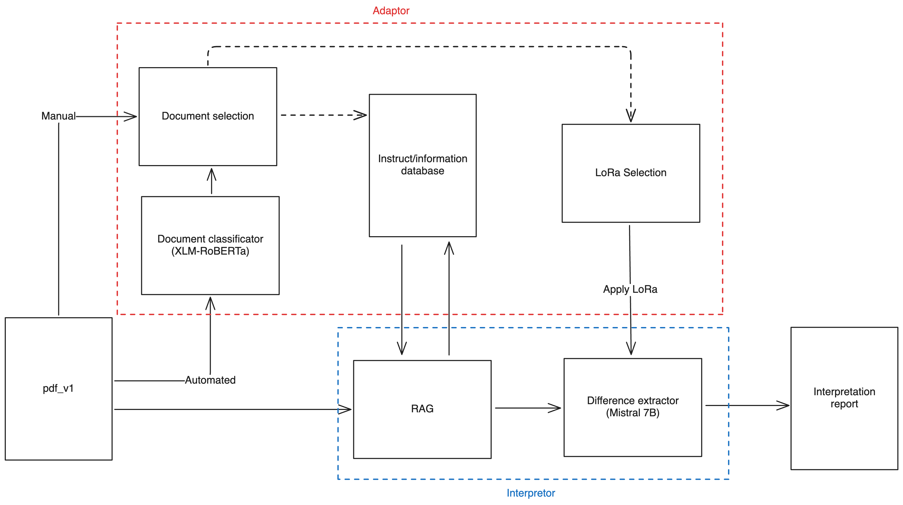

# General report interpretor
This app is designed to centralize and automate control report interpretation. 
Focus was put on updatability of control norms and report types, and on the reliability of the interpretation with regards of the applicable norms.
Used models are multi-lingual as it is conceived to be adapted to any language with the correct LoRa adaptations.

As a document is uploaded, a classifcation model (which has to be trained for the specific purpose) determines the document's type. [XLM-R](https://arxiv.org/pdf/1911.02116) is used for this purpose. Classification allows for selecting the correct information ressources to give the model context as well as using the correct LoRa to fine-tune the model. Many LoRa checkpoints can be loaded in cache to enhance model capabilities with reduced latency.  

With access to the coherent context, RAG is added to the prompt containing the report's information. The necessary LoRa checkpoint is loaded and the model produces a concise interpretation of the reports results.
